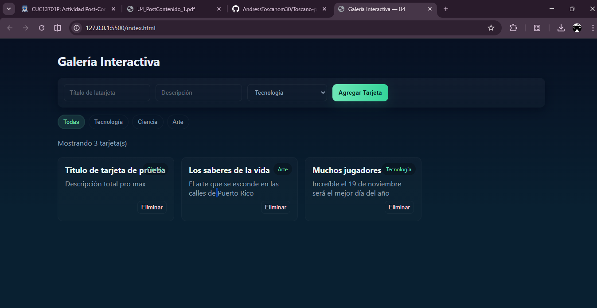

# Galería Interactiva — U4

Pequeña aplicación de muestra para crear, filtrar y eliminar tarjetas en una galería.

Cómo ejecutar
- Instala la extensión Live Server en VS Code.
- Abre la carpeta del proyecto en VS Code.
- Haz clic derecho en `index.html` y selecciona "Open with Live Server".

Alternativa (sin Live Server):
- Desde la terminal en la carpeta del proyecto usa Python 3:

```bash
python -m http.server 5500
```

Luego abre en el navegador: http://localhost:5500

Descripción del taller
- Crear tarjetas con título, descripción y categoría.
- Filtrar por categoría (Todas / Tecnología / Ciencia / Arte).
- Eliminar tarjetas usando el botón "Eliminar".
- Contador en tiempo real de tarjetas visibles.

Captura
 


Archivos principales
- `index.html` — estructura y controles.
- `app.js` — lógica de la aplicación (añadir, filtrar, eliminar, contador).
- `styles.css` — estilos y diseño.

¡Listo! Abre con Live Server y prueba la galería.